#  Predictive-Analysis-on-Bank-Marketing-Campaign 
Predicting customer's interest on Bank's Term Deposit

<h3> Introduction: </h3> 

This analysis is performed to predict the customer's interest on enrolling a Term Deposit at their Bank based on the bank's marketing campaigns data. This prediction is more towards the classification model as the results should be either yes or no on a binary format.    

<h3> Data Set Information: </h3>  

The data is related with direct marketing campaigns of a Portuguese banking institution. The marketing campaigns were based on phone calls. Often, more than one contact to the same client was required, in order to access if the product (bank term deposit) would be ('yes') or not ('no') subscribed.   

There are four datasets:   

   1) bank-additional-full.csv with all examples (41188) and 20 inputs, ordered by date (from May 2008 to November 2010), very close to the data analyzed   

   2) bank-additional.csv with 10% of the examples (4119), randomly selected from 1), and 20 inputs.  

   3) bank-full.csv with all examples and 17 inputs, ordered by date (older version of this dataset with less inputs).   

   4) bank.csv with 10% of the examples and 17 inputs, randomly selected from 3 (older version of this dataset with less inputs).   

The smallest datasets are provided to test more computationally demanding machine learning algorithms (e.g., SVM). 

The classification goal is to predict if the client will subscribe (yes/no) a term deposit (variable y).  
 

<h3> Exploratory Data Analysis </h3> 

This part of the analysis is the most important and more time consuming. This bank dataset is studied deeply by analyzing the every section of the data to identify the data issues like null values, outliers and for any data errors which could affect the efficiency of the predictive model. 

   <b>1.</b> This first step of the analysis is describing the data to find custim details of the records

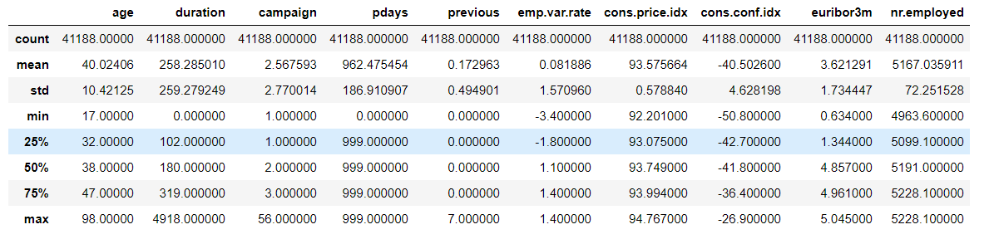

   <b>2.</b> When finding for the NULL values there are no such kind of values in the data rather than there were some data filled with value "unknown". This data is also not good for the analysis, so it all those entities are replaced with mode value of the respective columns 

   <b>3.</b> To identify the data distribution of every section, the values of the categorical columns and its frequency based on the output varible Term Deposit is displayed on table format for better understanding.
    
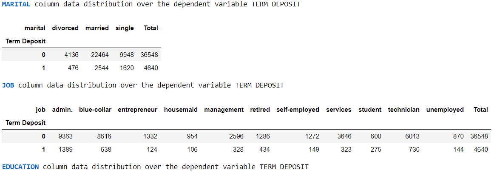

This below screen shot clearly explains that how these data is been distributed over a varible on the table. In this chart you could see that on the JOB pie chart the majority part of the data contributes to admin, blue-collar and technician and minor contribution is on housemaid profession. Similarly on the Contact pie chart the majority part is with cellular communication than the telephone.

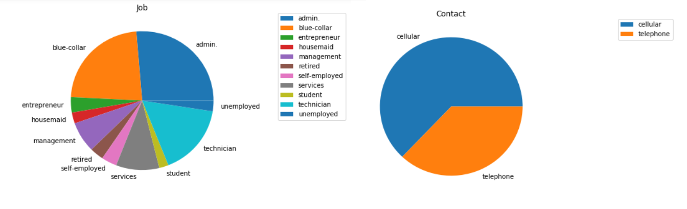 

   <b>4.</b> To indentify the outliers on the data. It has been verified on every numberic column through a custom build method and there are projected in the below image. This bar chart expresses that three column are with high outliers which are between 1500 to 3000 records and two column with minimum outliers which are around 450 records. 
   
   
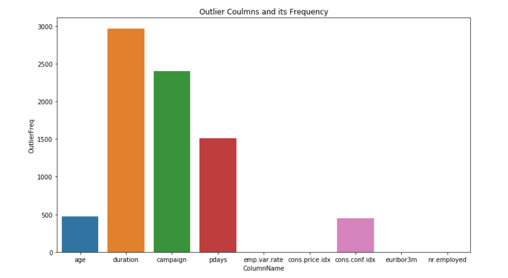    

To check the outliers on the two columns AGE and consumer confidence index the below image shows how well it has been distributed and showed the outliers 

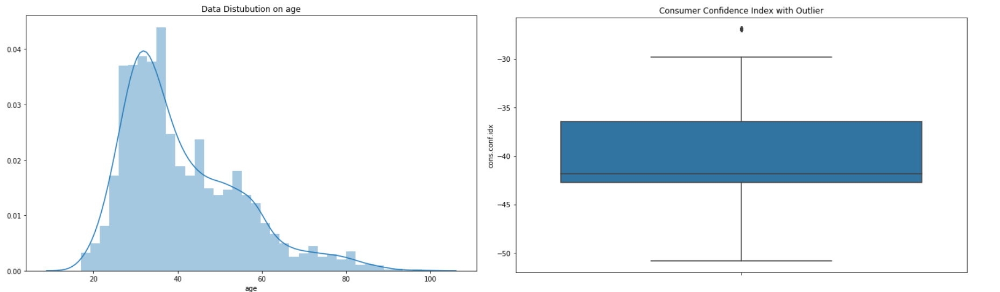 

After the removing the outliers from the two columns and removing the entire three columns from the dataframe, we could see that the data is looking better than before.

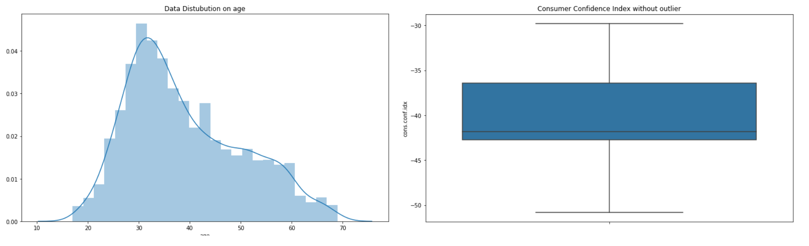

 <b>5.</b> Then to indentify the correlation of the every column the heat map would help us to indentify the relation more clearly. The blue color boxes has more correlation and red color boxes has les correlation relation among them. 
 
 
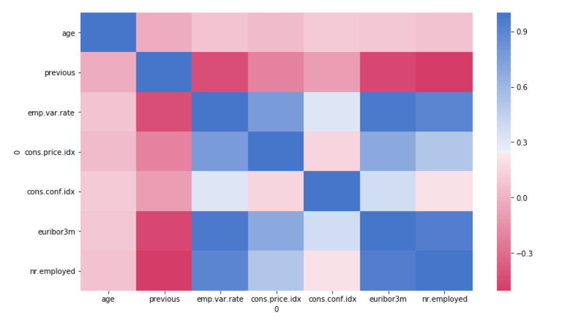 
 

 <b>6.</b> On further analysis, we could find that the relation between two columns on data distribution.
 
 The more Marital and Job variable could provide information that student profession has high influence on the deciding factor and the housemaid has low contribution. Similarly on the Contact and Job variable the more spike on the Cellular and student profession.
 
 
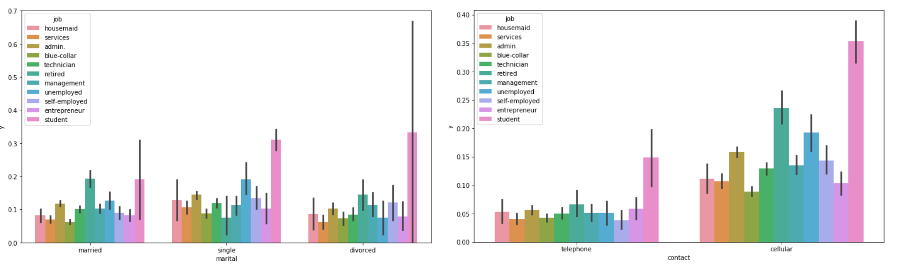 

On the sameway the Marital and education columns helps us to identify the spike on the illitrate category of the customers.

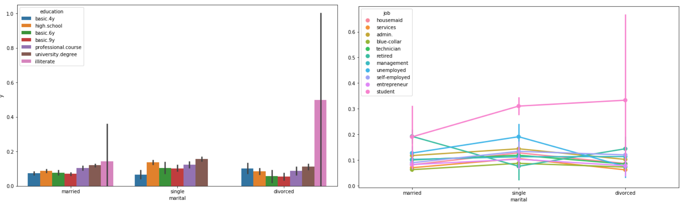 

At the end of the exploratory data analysis, we could understand the depth information about the bank marketing data by various strategies and error handling techniques. So lets move on to the next phase of the analytics for selecting two algorithm that best fits the data to provide high efficiency on prediction.    

<h3> ML Algorithm </h3>  

Since this dataset is based on the classification type, it requires ML algorithm which could classify the output has yes or no for whether the customer has Term deposit or not. By keeping this in mind the XGBoost and Support Vector Machine algorithm would best fits this data. 

Let's start with XGBoost    

<h3> XGBoost Algorithm </h3>  

XGBoost is an implementation of gradient boosted decision trees designed for speed and performance.

The implementation of the model supports the features of the scikit-learn and R implementations, with new additions like regularization. Three main forms of gradient boosting are supported:

Gradient Boosting algorithm also called gradient boosting machine including the learning rate.
Stochastic Gradient Boosting with sub-sampling at the row, column and column per split levels.
Regularized Gradient Boosting with both L1 and L2 regularization.

After extracting the output data from Exploratory data analysis, it has been convert to number data types and also converted all the categorical columns into 1 N 0 codding, which can be understood in a best way the algorithm.

The model has been tuned with two hyper parameter of the algorithm XGBoost with various possible values on it, so that we can analysis the results based on that. 

The two hyper parameter for XGBoost are given below:

1. subsample [default=1]  
Subsample ratio of the training instances. Setting it to 0.5 means that XGBoost would randomly sample half of the training data prior to growing trees. and this will prevent overfitting. Subsampling will occur once in every boosting iteration.
range: (0,1)  

2. colsample_bytree [default=1]  
Subsample ratio of columns when constructing each tree. Subsampling will occur once in every boosting iteration.
range: (0,1]  

After tuning the model, we have accuracy and area under curve metrics to evaluate the output. They both gradually increases as the value of the hyperparameter increases.

The tunes output of the XGBoost are:

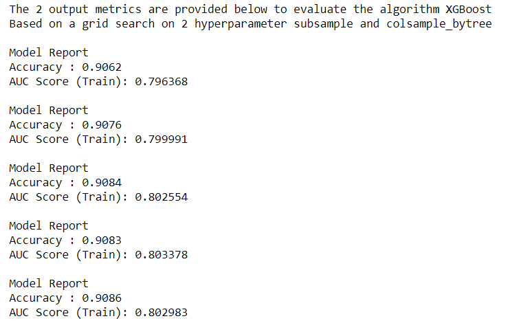 
   

<h3> Support Vector Machine Algorithm </h3>   

A Support Vector Machine (SVM) is a discriminative classifier formally defined by a separating hyperplane. In other words, given labeled training data (supervised learning), the algorithm outputs an optimal hyperplane which categorizes new examples.SVM is an exciting algorithm and the concepts are relatively simple. This post was written for developers with little or no background in statistics and linear algebra.As such we will stay high-level in this description and focus on the specific implementation concerns.

For SVM the two hyper parameter are used to have difference values on every model building and helps us to indentify that which value of the two hyper parameter provides the best results on the out put metrics.

The hyper parameters in SVM are given below: 

1. C  
The C parameter tells the SVM optimization how much you want to avoid misclassifying each training example. For large values of C, the optimization will choose a smaller-margin hyperplane if that hyperplane does a better job of getting all the training points classified correctly. Conversely, a very small value of C will cause the optimizer to look for a larger-margin separating hyperplane, even if that hyperplane misclassifies more points. For very tiny values of C, you should get misclassified examples, often even if your training data is linearly separable. 

2. cache_size  
Specify the size of the kernel cache. Kernel cache size: For SVC, SVR, nuSVC and NuSVR, the size of the kernel cache has a strong impact on run times for larger problems. If you have enough RAM available, it is recommended to set cache_size to a higher value than the default of 200(MB), such as 500(MB) or 1000(MB). 

After tunning the model with these two hyper parameter the output predictive eveluation is descripted in a classification report. This provides four metrics and they are provided below  

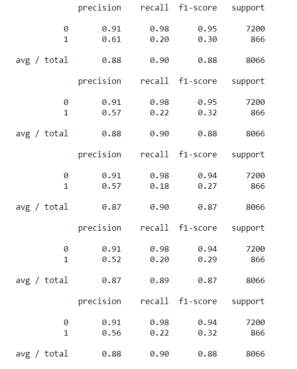 
   

<h3> Conclution </h3>  

This projects provides the detailed analysis for evaluating the predictive analysis on Bank's marketing dataset, which identifies the customer whether they have Term Deposit or not. Based on the Exploratory Data Analysis the understanding was very clear and provide meaning information on the charts and also provides the input structured data for the ML algorithms. On the Part B Both XGBoost and Support Vector Machine provides the best accuracy results, in which XGBoost has slightly higher accuracy than SVM. Also when looking into the performance SVM takes lot of time to build and fit the model when compare to XGBoost. So in conclusion the better results are provided by the XGBoost algorithm with accuracy of 90% and completes the process in a shorter time.   

<h3> References </h3> 

Dataset Source = https://archive.ics.uci.edu/ml/datasets/bank+marketing

 
